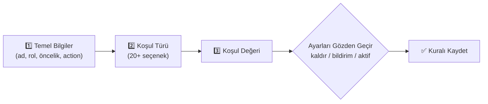

<div align="center">

# 🛡️ WNERSDEV Durum & Rol

### Discord presence/aktivite tabanlı otomatik rol yönetim altyapısı

[](https://nodejs.org)
[](https://discord.js.org)
[](https://www.mongodb.com)
[]()

**Presence'a göre rol ver, rol al, çakışmaları yönet — hepsi Discord içinden.**

<!--
  🎬 BURAYA ANA TANITIM GIF'İNİZİ EKLEYİN
  Örnek: Kontrol Merkezi panelinin açılışı + bir kural oluşturma akışı (10-15 saniye).
  Kayıt için: ScreenToGif (Windows), Kap (macOS) veya Peek (Linux) kullanabilirsiniz.
  Dosyayı repo içinde docs/gifs/tanitim.gif olarak kaydedip alttaki satırı aktif edin:
-->
<!--  -->

</div>

<br>

> 🇹🇷 Tüm yönetim Discord içinden yapılır — ayrı bir web paneli **yoktur**.
> Kurallar, roller, istisnalar, istatistikler; hepsi `/durumrol panel` ile açılan
> Components V2 **Kontrol Merkezi**'nden yönetilir.

---

## ✨ Neler Yapabilir?

| | Özellik | Açıklama |
|---|---|---|
| 🎮 | **Presence Takibi** | Online/idle/dnd, custom status, oyun, Spotify, yayın (streaming) |
| 🧠 | **Kural Motoru** | AND / OR / NOT koşul ağaçları, öncelik sıralaması |
| ⚔️ | **Rol Çakışma Yönetimi** | Tek-seçim (SINGLE) rol grupları, otomatik çözümleme |
| 🖱️ | **Manuel Rol Yönetimi** | `/rol ver` `/rol al` — hiyerarşi ve izin kontrolüyle |
| 🚦 | **Kuyruk & Cooldown** | Rate-limit güvenli, öncelikli (CRITICAL→LOW) işlem kuyruğu |
| 🔁 | **Reconciliation** | Periyodik otomatik senkronizasyon, drift önleme |
| 🛑 | **Fail-Safe** | Anomali tespitinde otomatik **SAFE MODE**, kill-switch'ler |
| 📊 | **İstatistik & Loglar** | Her rol işlemi ve yönetimsel eylem kayıt altında |
| 🔐 | **Çoklu Sunucu İzolasyonu** | Her sorgu `guildId` ile izole, veri asla karışmaz |

<br>

<!--
  🎬 KONTROL MERKEZİ GIF'İ
  Panelde gezinme: Ana Panel -> Kurallar -> Kural Ekle -> İstatistik geçişleri.
  Kaydedip docs/gifs/kontrol-merkezi.gif olarak koyduktan sonra aşağıyı aktif edin:
-->
<!--
<div align="center">

<p><em>Components V2 Kontrol Merkezi — kural ekleme sihirbazı</em></p>
</div>
-->

---

## 📚 İçindekiler

- [🚀 Hızlı Başlangıç](#-hızlı-başlangıç)
- [🧩 Gereksinimler](#-gereksinimler)
- [🤖 Discord Bot Oluşturma](#-discord-bot-oluşturma)
- [🔌 Gerekli Gateway Intent'ler](#-gerekli-gateway-intentler)
- [🔑 Bot İzinleri](#-bot-i̇zinleri)
- [⚙️ ayarlar.json](#️-ayarlarjson)
- [🏁 İlk Kurulum](#-i̇lk-kurulum)
- [📟 Komutlar](#-komutlar)
- [🧠 Kural Oluşturma](#-kural-oluşturma)
- [🎭 Durum Türleri](#-durum-türleri)
- [🪜 Rol Hiyerarşisi](#-rol-hiyerarşisi)
- [🔐 Güvenlik](#-güvenlik)
- [🏭 Production Çalıştırma](#-production-çalıştırma)
- [🛠️ Sorun Giderme](#️-sorun-giderme)

---

## 🚀 Hızlı Başlangıç

```bash
git clone <bu-repo>
cd wnersdev-durum-rol
npm install
cp ayarlar.example.json ayarlar.json
# ✍️  ayarlar.json dosyasını doldurun (aşağıya bakın)
npm run deploy-commands   # slash komutları Discord'a kaydeder
npm start                 # botu başlatır
```

<details>
<summary>💡 Local test'i çalıştırmak ister misiniz? (canlı Discord gerekmez)</summary>
<br>

```bash
npm run test:local
```

Bu komut syntax/import, config validation, kural motoru (AND/OR/NOT), rol
çakışma motoru, cooldown, kuyruk ve izin mantığını canlı bir Discord/MongoDB
bağlantısı **olmadan** test eder. Gerçek sunucuda canlı doğrulamanın yerini
tutmaz.

</details>

---

## 🧩 Gereksinimler

| Bileşen | Sürüm | Not |
|---|---|---|
| **Node.js** | ≥ 18.0.0 | `node --version` ile kontrol edin |
| **MongoDB** | ≥ 5.0 | Yerel kurulum veya [MongoDB Atlas](https://www.mongodb.com/atlas) ücretsiz katman |

> ⚠️ `mongoUri` boş bırakılırsa bot **DEVRE DIŞI modda** çalışır: Discord'a
> bağlanır ama hiçbir veri kalıcı olmaz. **Çökmez**, sadece uyarı basar.

---

## 🤖 Discord Bot Oluşturma

1. [discord.com/developers/applications](https://discord.com/developers/applications) → **New Application**
2. **Bot** sekmesi → bot oluşturun → **Token**'ı kopyalayıp `ayarlar.json → token` alanına yapıştırın 🔒
3. **OAuth2 → General** → **Client ID**'yi kopyalayıp `clientId` alanına yazın
4. **Bot** sekmesinde şu **Privileged Gateway Intent**'leri açın:
   - ✅ `SERVER MEMBERS INTENT`
   - ✅ `PRESENCE INTENT`
5. **OAuth2 → URL Generator** → `bot` + `applications.commands` scope'ları, [Bot İzinleri](#-bot-i̇zinleri)'ndeki izinleri seçip oluşan linkle botu sunucunuza ekleyin

<!--
  🎬 BOT KURULUMU GIF'İ (opsiyonel)
  Developer Portal'da token/intent açma adımlarının kısa kaydı.
  docs/gifs/bot-kurulumu.gif olarak ekleyip aşağıyı aktif edebilirsiniz:
-->
<!--  -->

---

## 🔌 Gerekli Gateway Intent'ler

Presence tabanlı sistem şu intent'lere ihtiyaç duyar (bkz. `wnersdev.js`):

- `Guilds`
- `GuildMembers` — üye/rol bilgisi için
- `GuildPresences` — durum/aktivite takibi için **(Privileged)**
- `GuildMessages`

> Developer Portal'da `GuildMembers` veya `GuildPresences` açık değilse bot
> **Türkçe bir hata mesajıyla** durumu bildirir ve çökmeden, ilgili özellik
> olmadan devam etmeye çalışır.

---

## 🔑 Bot İzinleri

Botun rolüne en az şu izinler verilmelidir:

- 🎭 **Rolleri Yönet** *(zorunlu)* — botun rolü, yönetmesi gereken **tüm rollerin üzerinde** bir pozisyonda olmalı (Discord hiyerarşi kuralı)
- 👁️ Kanalları Görüntüle, ✉️ Mesaj Gönder, 📜 Mesaj Geçmişini Görüntüle
- ⌨️ Uygulama Komutlarını Kullan

---

## ⚙️ ayarlar.json

`ayarlar.example.json` dosyasını `ayarlar.json` olarak kopyalayıp doldurun:

```json
{
  "token": "BOTUNUZUN_TOKENI",
  "clientId": "BOT_CLIENT_ID",
  "mongoUri": "mongodb://localhost:27017/wnersdev_durum_rol",
  "ownerIds": ["SIZIN_DISCORD_ID_NIZ"],
  "statusRoles": {
    "platforms": { "customStatus": true, "game": true, "spotify": true, "streaming": true, "activity": true }
  }
}
```

| Alan | Açıklama |
|---|---|
| `ownerIds` | `/sistem kill-switch`, `/sistem bakim`, `/sistem config-yenile` gibi kritik komutları kullanabilecek Discord kullanıcı ID'leri |
| `statusRoles.platforms.*` | `false` yapılan platform için ilgili koşullar (ör. `spotify: false` → `spotifyActive` vb.) hiç değerlendirilmez |

> ✅ Eksik/hatalı bir alan botu **çökertmez** — terminale Türkçe uyarı basılır, en güvenli varsayılanla devam edilir.

---

## 🏁 İlk Kurulum

Bot sunucunuza eklendikten sonra, yönetici olarak:

```
/durumrol kur [log-kanali: #log-kanaliniz]
```

Ardından Kontrol Merkezi'ni açın:

```
/durumrol panel
```

<!--
  🎬 İLK KURULUM GIF'İ
  /durumrol kur -> /durumrol panel -> Kural Ekle akışının kaydı.
  docs/gifs/ilk-kurulum.gif olarak ekleyip aşağıyı aktif edin:
-->
<!--
<div align="center">

</div>
-->

**Kural Ekle** ile ilk kuralınızı, **Genel Ayarlar**'dan korumalı rolleri ve
istisnaları yapılandırabilirsiniz.

---

## 📟 Komutlar

<table>
<tr><th>Komut</th><th>Alt Komutlar</th></tr>
<tr>
<td><code>/durumrol</code></td>
<td>

`panel` `kur` `ac` `kapat` `durum` `kurallar` `senkronize` `kullanici-tara`
`test` `istatistik` `loglar` `istisnalar kullanici-ekle` `istisnalar
kullanici-cikar` `istisnalar listele` `tercihlerim` `disa-aktar` `ice-aktar`

</td>
</tr>
<tr>
<td><code>/rol</code></td>
<td>

`ver` `al` `bilgi` `liste`

</td>
</tr>
<tr>
<td><code>/sistem</code></td>
<td>

`durum` `istatistik` `config-yenile` 🔒`OWNER` `bakim` 🔒`OWNER` `kill-switch` 🔒`OWNER`

</td>
</tr>
</table>

---

## 🧠 Kural Oluşturma

`/durumrol panel` → **Kural Ekle** ile 3 adımlı sihirbaz açılır:



<!--
  🎬 KURAL SİHİRBAZI GIF'İ
  3 adımlık modal + select akışının kaydı — en etkili demo genelde budur.
  docs/gifs/kural-sihirbazi.gif olarak ekleyip aşağıyı aktif edin:
-->
<!--  -->

Karmaşık AND/OR/NOT koşulları oluşturmak için `/durumrol disa-aktar` ile
kuralları JSON olarak alıp `conditions` alanını düzenleyip
`/durumrol ice-aktar` ile geri yükleyebilirsiniz:

```json
{
  "logic": "AND",
  "conditions": [
    { "type": "online" },
    { "logic": "NOT", "conditions": [{ "type": "hasRole", "value": "123..." }] },
    { "logic": "OR", "conditions": [
      { "type": "gameContains", "value": "VALORANT" },
      { "type": "gameContains", "value": "Minecraft" }
    ]}
  ]
}
```

---

## 🎭 Durum Türleri

| Kategori | Koşullar |
|---|---|
| 🟢 **Durum** | `online` `idle` `dnd` `offline` |
| 💬 **Custom Status** | tam eşleşme · içeriyor · içermiyor · başlıyor · bitiyor · regex |
| 🎮 **Oyun/Aktivite** | name · type · state · details · applicationId |
| 🎵 **Spotify** | aktif · şarkı · sanatçı · albüm |
| 📺 **Streaming** | aktif · platform · URL · yayın adı |

> `statusRoles.platforms` içinde `false` yapılan bir platformun koşulları hiç değerlendirilmez.

---

## 🪜 Rol Hiyerarşisi

Discord'da roller bir **hiyerarşiye** sahiptir: bot yalnızca **kendi en yüksek
rolünden düşük pozisyondaki** rolleri ekleyip kaldırabilir.

```
🤖 Bot Rolü            ← en üstte olmalı
├── 🎮 Valorant
├── 🎵 Spotify Dinleyici
└── 🚫 (Korumalı Rol)  ← otomatik sistem hiç dokunmaz
```

- Bot rolünüzü yönetilecek tüm rollerin **üzerine** taşıyın (Sunucu Ayarları → Roller)
- Uygun değilse işlem **güvenle reddedilir** ve loglanır — hataya düşülmez
- **Korumalı roller** (Genel Ayarlar) hiçbir koşulda otomatik değiştirilmez

---

## 🔐 Güvenlik

- 🧱 Tüm veritabanı sorguları `guildId` ile izole — bir sunucunun verisi asla başka sunucuya sızmaz
- 🐢 Kullanıcı regex'leri (custom status regex) uzunluk + tehlikeli kalıp (ReDoS) + çalışma süresi sınırıyla korunur
- 🆔 Tüm Discord ID'leri format doğrulamasından geçer
- ✅ Rol işlemi öncesi sırayla: varlık → bot izni → hiyerarşi → `managed` rol → korumalı rol → istisna → duplicate kontrolü
- 🚦 Tüm rol işlemleri öncelikli (`CRITICAL/HIGH/NORMAL/LOW`) kuyruktan geçer — rate-limit güvenli
- 🚨 Anomali tespitinde (`ROLE_ACTION_SPIKE`) otomatik **SAFE MODE** — işlemler durur, admin uyarılır
- 📝 Her rol işlemi `RoleActionLog`'a, her yönetimsel eylem `AuditLog`'a kaydedilir

---

## 🏭 Production Çalıştırma

```bash
NODE_ENV=production npm start
```

- Süreç yöneticisi olarak `pm2` veya `systemd` önerilir
- `SIGINT`/`SIGTERM` sinyalinde: presence işleme durur → kuyruk güvenle boşalır → reconciliation durur → MongoDB kapanır → cache temizlenir (graceful shutdown)
- Reconciliation varsayılan olarak her 30 dakikada bir çalışır (`ayarlar.json → reconciliation.intervalMinutes`)

---

## 🛠️ Sorun Giderme

| 🚩 Sorun | 🔍 Olası Sebep / Çözüm |
|---|---|
| Bot açılmıyor, "token veya clientId ayarlanmamış" | `ayarlar.json` dosyasını doldurun |
| Roller hiç değişmiyor | Bot rolünün hiyerarşide **yukarıda** olduğundan ve `Rolleri Yönet` izninden emin olun |
| Presence hiç güncellenmiyor | Developer Portal'da `SERVER MEMBERS INTENT` ve `PRESENCE INTENT` açık mı? |
| "SAFE MODE aktif" uyarısı | `/sistem durum` ile inceleyin; anormal işlem hacmi tespit edildi |
| Kural hiç eşleşmiyor | `/durumrol test` ile test edin; koşul değerini ve `platforms` ayarını kontrol edin |
| MongoDB bağlanamıyor | `mongoUri` doğru mu? Bağlanamasa bile bot DEVRE DIŞI modda ayakta kalır |

---

<div align="center">

Made with 🖤 for **WNERSDEV** — sorularınız için sunucu içi log kanalınızı takip etmeyi unutmayın.

</div>
